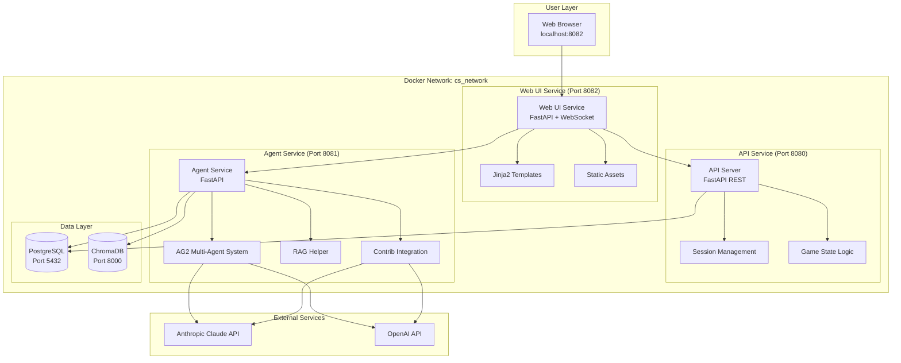
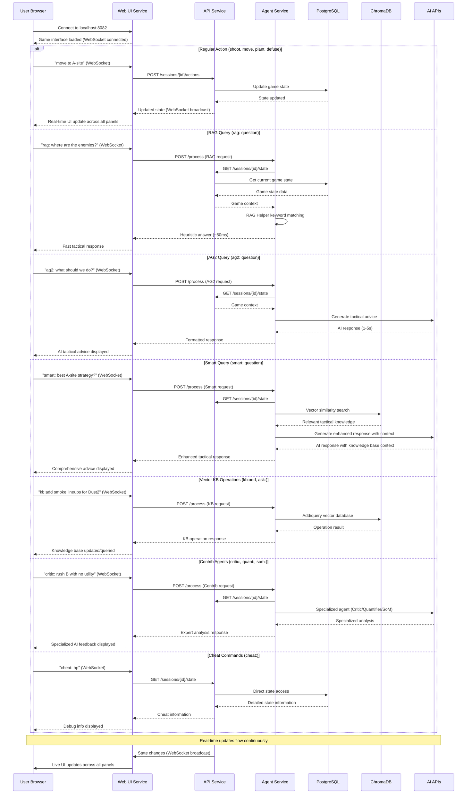
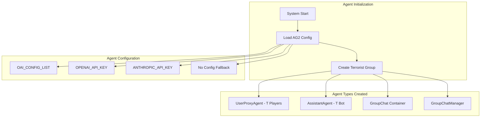

# Current Counter-Strike AG2 System Flow Diagram

## Microservices Architecture Overview



## Detailed Web-Based Command Flow



## Agent Creation and Management Flow



## Command Type Routing

```mermaid
flowchart TD
    INPUT[User Input] --> PARSE{Parse Command Type}
    
    PARSE -->|"action:"| GAME_ACTION[Game Action]
    PARSE -->|"rag:"| RAG_QUERY[RAG Query]
    PARSE -->|"ag2:"| AG2_QUERY[AG2 Agent Query]
    PARSE -->|"smart:"| SMART_QUERY[Smart Query]
    PARSE -->|"kb:add"| KB_ADD[Vector KB Add]
    PARSE -->|"kb:load"| KB_LOAD[Vector KB Load]
    PARSE -->|"ask:"| KB_ASK[Vector KB Query]
    PARSE -->|"critic:"| CRITIC[Critic Agent]
    PARSE -->|"quant:"| QUANTIFIER[Quantifier Agent]
    PARSE -->|"som:"| SOCIETY[Society of Mind]
    PARSE -->|"cheat:"| CHEAT[Cheat Commands]
    PARSE -->|default| GAME_ACTION
    
    GAME_ACTION --> GAME_STATE[GameState.apply_action()]
    RAG_QUERY --> RAG_HELPER[RagTerroristHelper.answer()]
    AG2_QUERY --> AG2_BOT[Terrorist Bot Agent]
    SMART_QUERY --> COMBINED[AG2 + Vector KB]
    KB_ADD --> CHROMA[ChromaDB]
    KB_LOAD --> CHROMA
    KB_ASK --> CHROMA
    CRITIC --> CONTRIB_CRITIC[CriticAgent]
    QUANTIFIER --> CONTRIB_QUANT[QuantifierAgent]
    SOCIETY --> CONTRIB_SOM[SocietyOfMindAgent]
    CHEAT --> DIRECT_STATE[Direct State Access]
```

## Key Components Breakdown

### 1. **Web UI Service** (services/web_ui.py) - Frontend Orchestrator
- Serves modern web interface on port 8082
- Handles WebSocket connections for real-time updates
- Routes user commands to appropriate backend services
- Manages multi-panel display state (3 Terrorist + 1 CT)
- Broadcasts game state changes to all connected clients

### 2. **API Service** (services/api_server.py) - Core Game Backend
- FastAPI REST server on port 8080
- Manages game sessions and persistent state
- Validates and applies game actions
- Maintains round/score state in PostgreSQL
- Provides health checks and monitoring endpoints

### 3. **Agent Service** (services/agent_service.py) - AI Processing Hub
- FastAPI service on port 8081 dedicated to AI operations
- **AG2 Multi-Agent System**: Creates and manages terrorist/CT agents
- **RAG Helper**: Fast offline heuristic responses using game facts
- **Contrib Integration**: Specialized agents (Critic, Quantifier, SoM)
- **Vector RAG Client**: Interfaces with ChromaDB for semantic search

### 4. **PostgreSQL Database** - Persistent Game Storage
- Stores game sessions, player actions, and state history
- Provides ACID transactions for game state consistency
- Connection pooling for efficient multi-service access
- Health checks and backup capabilities

### 5. **ChromaDB** - Vector Knowledge Base
- Semantic search over Counter-Strike tactical knowledge
- Persistent vector storage with similarity search
- Supports knowledge base expansion via kb:add commands
- Integration with sentence-transformers for offline embeddings

### 6. **Docker Network** - Service Communication
- Internal cs_network for secure service-to-service communication
- Environment variable configuration for service discovery
- Health check dependencies and startup ordering
- Volume persistence for data across container restarts

## Agent Usage Patterns

### Current Agent Calls:
1. **ag2:** - Direct call to AG2 multi-agent system with game context
2. **smart:** - Combined AG2 agent + ChromaDB vector search
3. **rag:** - Fast RAG helper with keyword matching (~50ms)
4. **critic:** - CriticAgent for strategy plan evaluation
5. **quant:** - QuantifierAgent for option ranking and selection
6. **som:** - SocietyOfMindAgent for multi-expert reasoning
7. **kb:add/ask:** - Direct ChromaDB vector operations

### Microservices Response Flow:
1. User command received via WebSocket in Web UI Service
2. Web UI Service routes to appropriate backend service (API or Agent)
3. Agent Service retrieves game context from API Service
4. Agent Service processes request (RAG/AG2/Contrib/Vector)
5. Response formatted and returned to Web UI Service
6. Web UI Service broadcasts response via WebSocket to all connected clients
7. Real-time UI updates across all panels

This microservices architecture provides excellent separation of concerns with dedicated services for UI, game logic, AI processing, and data storage. The WebSocket-based real-time updates ensure all players see changes instantly, while the containerized approach enables easy scaling and deployment.