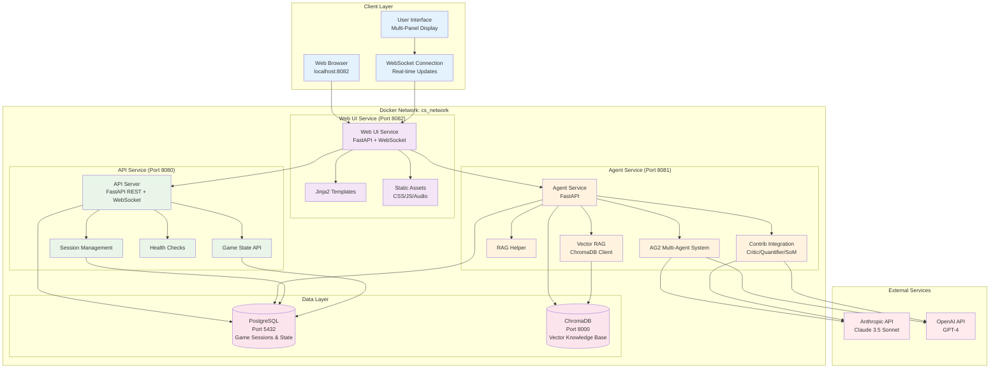

# Counter-Strike AG2 Agent System Architecture

## System Overview

The Counter-Strike AG2 Agent system is a distributed microservices architecture that combines traditional game mechanics with modern AI agent orchestration, vector knowledge bases, and specialized contrib agents. The system runs entirely in Docker containers with a web-based interface.

## Microservices Architecture Diagram

## Service Descriptions

### Client Layer
- **Web Browser**: Modern browser-based interface accessible at localhost:8082
- **Multi-Panel Display**: 3 Terrorist panels + 1 Counter-Terrorist panel with real-time updates
- **WebSocket Connection**: Instant bidirectional communication for game state updates

### Web UI Service (Container: cs_web_ui)
- **FastAPI Web Server**: Serves HTML interface and handles WebSocket connections
- **Jinja2 Templates**: Dynamic HTML generation with game state integration
- **Static Assets**: CSS styling, JavaScript interactivity, and audio effects
- **Real-time Broadcasting**: Pushes game state updates to all connected clients

### API Service (Container: cs_api)
- **REST API**: Game session management, state queries, and action processing
- **WebSocket Server**: Real-time game state broadcasting
- **Session Management**: Creates, tracks, and manages game sessions
- **Health Monitoring**: Service health checks and status reporting

### Agent Service (Container: cs_agents)
- **AG2 Multi-Agent System**: Orchestrates AI agent conversations and responses
- **RAG Helper**: Fast offline heuristic responses using game state facts
- **Contrib Integration**: Specialized agents (Critic, Quantifier, Society of Mind)
- **Vector RAG Client**: Interfaces with ChromaDB for semantic knowledge retrieval

### Data Layer
- **PostgreSQL**: Persistent storage for game sessions, state, and action history
- **ChromaDB**: Vector database for semantic search over tactical knowledge base
- **Persistent Volumes**: Docker volumes for data persistence across container restarts

## Key Architectural Improvements

### 1. Microservices Architecture
- **Evolution**: From monolithic Pygame application to distributed Docker services
- **Benefits**: Better scalability, fault isolation, independent deployments
- **Implementation**: Separate containers for UI, API, agents, and data layers

### 2. Web-Based Interface
- **Evolution**: From Pygame desktop UI to modern web browser interface
- **Benefits**: Cross-platform compatibility, better UX, real-time updates
- **Implementation**: FastAPI + WebSocket + modern HTML/CSS/JS

### 3. Service Communication
- **Pattern**: HTTP REST APIs for service-to-service communication
- **Real-time**: WebSocket connections for instant game state updates
- **Implementation**: Internal Docker network with service discovery

### 4. Data Persistence
- **Storage**: PostgreSQL for structured game data, ChromaDB for vector knowledge
- **Persistence**: Docker volumes ensure data survives container restarts
- **Implementation**: Async database connections with connection pooling

### 5. Container Orchestration
- **Deployment**: Docker Compose for local development and testing
- **Health Checks**: Service health monitoring and dependency management
- **Implementation**: Structured service dependencies and health endpoints

### 6. Configuration Management
- **Environment**: Environment variables for service configuration
- **Secrets**: API keys and sensitive data managed via .env files
- **Implementation**: Centralized configuration with fallback defaults

## Data Flow

### Web Request Flow
1. User inputs command in web browser interface
2. JavaScript sends action via WebSocket to Web UI Service
3. Web UI Service forwards request to API Service
4. API Service validates and processes game actions
5. Game state updated in PostgreSQL database
6. API Service broadcasts update to all connected clients via WebSocket

### Agent Processing Flow
1. AI query (ag2:, smart:, critic:) sent to Agent Service
2. Agent Service retrieves game context from API Service
3. Appropriate AI agent processes query with LLM API calls
4. Response formatted and returned to Web UI Service
5. Web UI Service broadcasts response to connected clients
6. Browser displays response in appropriate panel

### Knowledge Base Flow
1. Vector query processed by Agent Service
2. ChromaDB performs semantic similarity search
3. Relevant documents retrieved and ranked
4. Results combined with game context
5. Enhanced response returned to user interface

### Real-time Update Flow
1. Game state change occurs in API Service
2. Database updated with new state
3. WebSocket broadcast sent to Web UI Service
4. Web UI Service pushes updates to all connected browsers
5. JavaScript updates interface elements dynamically

## Performance Characteristics

### Response Times
- **Web UI updates**: <50ms (WebSocket real-time updates)
- **Game actions**: 100-300ms (database persistence + broadcast)
- **RAG queries**: 50-200ms (ChromaDB vector search)
- **AG2 agent queries**: 1-5s (LLM API calls + processing)
- **Contrib agents**: 1-5s (specialized LLM interactions)

### Resource Usage
- **Web UI Service**: ~50MB memory, minimal CPU
- **API Service**: ~100MB memory, moderate CPU for game logic
- **Agent Service**: ~200MB memory, high CPU during AI processing
- **PostgreSQL**: ~100MB memory + storage for game data
- **ChromaDB**: ~150MB memory + persistent vector storage

### Scalability
- **Concurrent users**: Multiple browsers can connect simultaneously
- **Horizontal scaling**: Services can be scaled independently
- **Database connections**: Connection pooling for efficient resource usage
- **Load balancing**: Ready for reverse proxy deployment

## Security Considerations

### Container Security
- Docker network isolation between services and external access
- Environment variables for API keys, never hardcoded in images
- Non-root user execution within containers
- Regular base image updates for security patches

### API Security
- CORS middleware configured for web browser access
- Input validation on all API endpoints
- Health check endpoints for monitoring
- Graceful error handling without information disclosure

### Data Security
- PostgreSQL with authentication and encrypted connections
- ChromaDB isolated within Docker network
- Persistent volumes with appropriate permissions
- No sensitive data logged to console or files

## Future Architecture Considerations

### Production Deployment
1. **Container Orchestration**: Kubernetes deployment with auto-scaling
2. **Load Balancing**: Nginx/Traefik for traffic distribution
3. **Service Mesh**: Istio for advanced traffic management
4. **Monitoring**: Prometheus + Grafana for metrics and alerting
5. **Secrets Management**: Kubernetes secrets or HashiCorp Vault

### Performance Enhancements
1. **Caching Layer**: In-memory caching for session state and frequent queries
2. **CDN Integration**: Static asset delivery optimization
3. **Database Optimization**: Read replicas and connection pooling
4. **Agent Response Caching**: Cache frequent LLM responses
5. **Async Processing**: Background job queues for heavy operations

### Advanced Features
1. **Multi-tenant Support**: Isolated game sessions per user group
2. **Real-time Analytics**: Game performance metrics and dashboards
3. **Plugin Architecture**: Dynamic agent loading and custom strategies
4. **Cloud Integration**: Optional cloud-based knowledge base sync
5. **Mobile Interface**: Responsive design for mobile browsers

This microservices architecture provides a robust, scalable foundation for the Counter-Strike AG2 agent system with clear separation of concerns and excellent extensibility for future enhancements.
